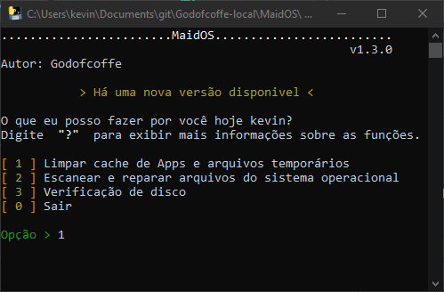

# MaidOS
### Um programinha isento de instalação, com todo o espaço ocupado menor que 10 MB (codigo fonte + executavel)

***
## limpeza de cache
* 5 diretórios de arquivos .temp
* 1 função de limpeza de cache DNS
* 1 diretório do cache do navegador Google Chrome
* 1 diretório do cache do Windows Update

## Reparos
**Ferramentas:**
* DISM.EXE: Para versões mais atuais do Windows, como o 10 e 8
* SFC: Para versões anteriores

## Disco
Usa o comando padrão do cmd `CHKDSK` para a verificação

***
[Clique aqui para ver a nota de atualização e baixar a última versão](https://github.com/Godofcoffe/MaidOS/releases/latest)
